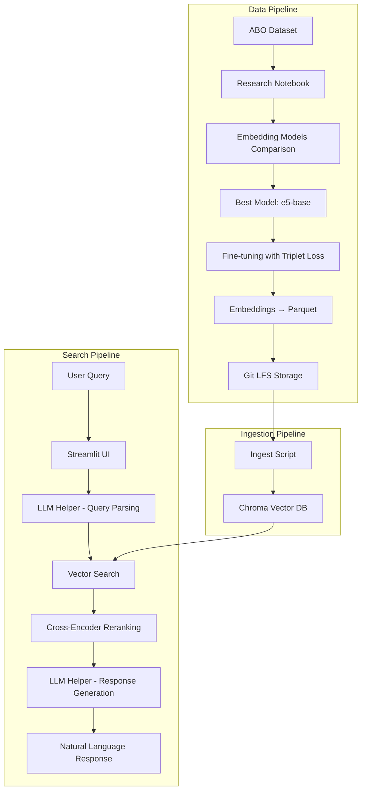
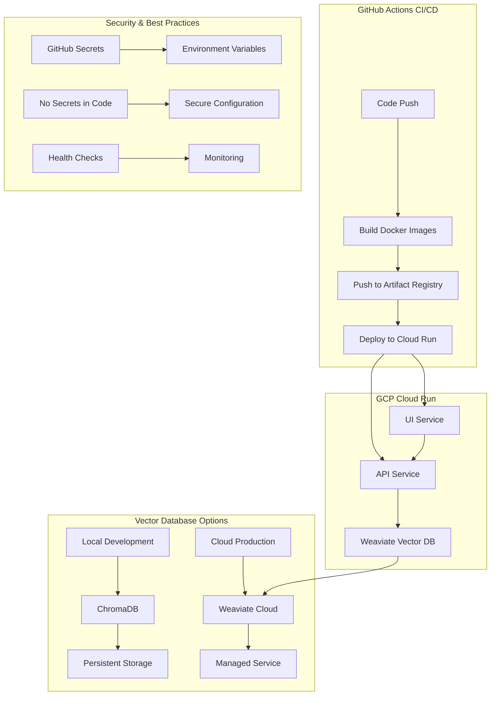

# ShopTalk Search Assistant

An intelligent e-commerce product search system that uses natural language processing, RAG (Retrieval-Augmented Generation), and LLM-powered natural language generation to help users find products through conversational queries.

## 🏗️ High-Level Architecture



## 🔧 System Components

### 1. **Research & Model Selection** (`research/`)
- **Notebook**: `research/eda/ShopTalk_ABO_EDA_Embeddings.ipynb`
- **Purpose**: Download ABO dataset, compare 3 pre-trained embedding models
- **Metrics**: Recall@10 and NDCG@10
- **Winner**: e5-base model
- **Fine-tuning**: Triplet loss optimization for better product embeddings

### 2. **Data Storage** (`data/`)
- **Parquet Files**: Product embeddings stored as compressed parquet
- **Git LFS**: Large files tracked with Git Large File Storage
- **Manifest**: Model metadata and training information

### 3. **Ingestion Pipeline** (`ingest/`)
- **Scripts**: Load and rebuild local Chroma vector database
- **Vector DB**: Persistent storage for semantic search
- **Indexing**: HNSW-based cosine similarity search

### 4. **API Layer** (`api/`)
- **FastAPI**: RESTful API for search endpoints
- **LLM Helper**: LangChain integration with OpenAI for query parsing and response generation
- **Vector Search**: Semantic similarity search with filtering
- **Reranking**: Cross-encoder model for result refinement

### 5. **User Interface** (`ui/`)
- **Streamlit**: Interactive web interface for natural language queries
- **Real-time Search**: Live search results with product details
- **Responsive Design**: User-friendly product discovery experience

## 🚀 Quick Start

### Prerequisites
- Python 3.9+
- Git LFS (for large file handling)
- OpenAI API key

### 1. Clone and Setup
```bash
# Clone the repository
git clone <repository-url>
cd shoptalk-search-assistant

# Install Git LFS (if not already installed)
git lfs install
git lfs pull

# Create virtual environment
python -m venv venv
source venv/bin/activate  # On Windows: venv\Scripts\activate
```

### 2. Install Dependencies
```bash
# Install API dependencies
pip install -r api/requirements.txt

# Install ingestion dependencies
pip install -r ingest/requirements.txt

# Install UI dependencies
pip install -r ui/requirements.txt
```

### 3. Environment Configuration
```bash
# Create .env file with your configuration
cat > .env << EOF
OPENAI_API_KEY=your_openai_api_key_here
OPENAI_BASE_URL=https://api.openai.com/v1
MODEL_NAME=mananthakris/e5-base-ft-abo
DB_PATH=vectordb
PARSE_MODEL=gpt-4o-mini
NLG_MODEL=gpt-4o-mini
EOF

# Load environment variables
export $(cat .env | xargs)
```

### 4. Build Vector Database
```bash
# Option A: Use makefile (recommended)
make seed

# Option B: Direct command
python ingest/rebuild_index.py --parquet data/products_e5-base.parquet --db-path vectordb --collection products --wipe
```

### 5. Start the Application

#### Option A: Start API Server
```bash
# Start the FastAPI server
uvicorn api.main:app --reload --port 8000

# Visit http://localhost:8000/docs for API documentation
```

#### Option B: Start Streamlit UI
```bash
# Start the Streamlit interface
streamlit run ui/app.py

# Open http://localhost:8501 in your browser
```

#### Option C: Use Makefile
```bash
# Rebuild vector database
make seed

# Run tests
make test

# Build Docker images for production
make build
```

## 🐳 Production Deployment

This project is **production-ready** with full containerization and automated deployment to Google Cloud Platform (GCP) Cloud Run.

### 🏗️ Production Architecture



### 🚀 Automated Deployment Features

#### ✅ **Containerization**
- **Multi-stage Docker builds** for optimized image sizes
- **Health checks** for both API and UI services
- **CPU-optimized PyTorch** for Cloud Run compatibility
- **Security best practices** (non-root user, minimal base images)

#### ✅ **CI/CD Pipeline**
- **GitHub Actions** automated deployment
- **Google Artifact Registry** for container images
- **Zero-downtime deployments** with Cloud Run
- **Environment-specific configurations**
- **Vector database abstraction** (ChromaDB local, Weaviate cloud)

#### ✅ **Production Security**
- **Secrets management** via GitHub Secrets (no secrets in code)
- **Environment variables** for configuration
- **Authenticated deployments** with service accounts
- **Network security** with Cloud Run's built-in features

### 🔧 Deployment Configuration

#### Required GitHub Secrets
```bash
# GCP Configuration
GCP_CREDENTIALS          # Service account JSON
GCP_PROJECT_ID          # GCP Project ID
GCP_REGION             # Deployment region

# Application Configuration
OPENAI_API_KEY         # OpenAI API key
OPENAI_BASE_URL        # OpenAI endpoint (optional)
PARSE_MODEL           # LLM model for parsing
NLG_MODEL             # LLM model for generation

# Vector Database Configuration (Cloud)
WEAVIATE_URL          # Weaviate cluster URL
WEAVIATE_API_KEY      # Weaviate API key
WEAVIATE_CLASS_NAME   # Weaviate collection name (default: Product)
```

#### Cloud Run Services
- **API Service**: `shoptalk-api` (2 CPU, 8GB RAM) - Optimized for vector operations
- **UI Service**: `shoptalk-ui` (1 CPU, 512MB RAM)
- **Auto-scaling**: 0-100 instances based on traffic
- **Public access**: Unauthenticated (configurable)
- **Vector Database**: Weaviate Cloud (managed service, no memory constraints)

### 🗄️ Vector Database Setup

#### Local Development (ChromaDB)
```bash
# Build local vector database
make seed

# Or manually
python ingest/rebuild_index.py --parquet data/products_e5-base.parquet --db-path vectordb --collection products --wipe
```

#### Cloud Production (Weaviate)
```bash
# 1. Create Weaviate cluster at https://console.weaviate.cloud
# 2. Get cluster URL and API key from dashboard
# 3. Set environment variables
export WEAVIATE_URL="your-cluster-url"
export WEAVIATE_API_KEY="your-api-key"
export WEAVIATE_CLASS_NAME="Product"

# 4. Migrate data from local ChromaDB to Weaviate
python migrate_to_weaviate.py
```

#### Migration Process
The migration script (`migrate_to_weaviate.py`) performs the following:
1. **Connects** to local ChromaDB and Weaviate cluster
2. **Creates schema** in Weaviate with product properties
3. **Transfers data** in batches (100 products at a time)
4. **Verifies migration** by counting total products
5. **Handles 145,615+ products** efficiently

#### Vector Database Abstraction
The system uses a `VectorDB` abstraction layer that automatically:
- **Detects environment** (local vs cloud) via `USE_WEAVIATE` flag
- **Routes queries** to appropriate database (ChromaDB or Weaviate)
- **Maintains compatibility** with existing search logic
- **Handles authentication** and connection management

### 🛠️ Manual Deployment

#### Build and Push Images
```bash
# Build API image
docker build -t ghcr.io/your-org/shoptalk-api:latest ./api

# Build UI image  
docker build -t ghcr.io/your-org/shoptalk-ui:latest ./ui

# Push to registry
docker push ghcr.io/your-org/shoptalk-api:latest
docker push ghcr.io/your-org/shoptalk-ui:latest
```

#### Deploy to Cloud Run
```bash
# Deploy API
gcloud run deploy shoptalk-api \
  --image ghcr.io/your-org/shoptalk-api:latest \
  --region us-central1 \
  --platform managed \
  --allow-unauthenticated \
  --memory 1Gi \
  --cpu 1 \
  --port 8000 \
  --set-env-vars "OPENAI_API_KEY=your-key,DB_PATH=/data"

# Deploy UI
gcloud run deploy shoptalk-ui \
  --image ghcr.io/your-org/shoptalk-ui:latest \
  --region us-central1 \
  --platform managed \
  --allow-unauthenticated \
  --memory 512Mi \
  --cpu 1 \
  --port 8501 \
  --set-env-vars "API_URL=https://your-api-url"
```

### 📊 Production Monitoring

#### Health Checks
- **API Health**: `GET /health` endpoint
- **UI Health**: Streamlit health endpoint
- **Automatic restarts** on health check failures

#### Logging & Observability
- **Structured logging** with request/response tracking
- **Cloud Run logs** integration
- **Performance metrics** and error tracking
- **Query parsing** and filtering logs

#### Performance Optimization
- **CPU-optimized models** for Cloud Run
- **Efficient vector search** with Chroma
- **Connection pooling** and caching
- **Timeout protection** (30-second limits)

### 🔒 Security Features

#### Secrets Management
- ✅ **No secrets in repository**
- ✅ **GitHub Secrets** for sensitive data
- ✅ **Environment variables** for configuration
- ✅ **Service account authentication**

#### Network Security
- ✅ **HTTPS by default** (Cloud Run)
- ✅ **Authenticated deployments**
- ✅ **Private container registry**
- ✅ **Configurable access controls**

#### Application Security
- ✅ **Input validation** and sanitization
- ✅ **SQL injection protection** (parameterized queries)
- ✅ **Rate limiting** (Cloud Run built-in)
- ✅ **Error handling** without information leakage

### 🌐 Production URLs

After deployment, your services will be available at:
- **API**: `https://shoptalk-api-xxx-uc.a.run.app`
- **UI**: `https://shoptalk-ui-xxx-uc.a.run.app`
- **API Docs**: `https://shoptalk-api-xxx-uc.a.run.app/docs`

## 🔍 Usage Examples

### API Endpoints

#### Search Products
```bash
curl "http://localhost:8000/answer?q=red%20running%20shoes&k=10"
```

#### Health Check
```bash
curl "http://localhost:8000/health"
```

### Natural Language Queries
- "phone case with white flowers"
- "red running shoes under $100"
- "jewelry with diamonds"
- "modern furniture for living room"
- "wireless headphones with noise cancellation"

## 🧪 Testing

### Test Suite Overview
The project includes comprehensive tests covering all major components:

```bash
# Run all tests
python -m pytest tests/

# Run specific test categories
python -m pytest tests/test_api_health.py          # API health checks
python -m pytest tests/test_embed_and_retreive.py  # Embedding functionality
python -m pytest tests/test_env.py                 # Environment configuration
python -m pytest tests/test_llm_parse_stub.py      # LLM parsing logic
python -m pytest tests/test_weaviate_connection.py # Weaviate connectivity
python -m pytest tests/test_vector_db_abstraction.py # Vector DB abstraction
```

### Test Categories

#### 🔗 **Connection Tests**
- **Weaviate Connection**: Tests cluster connectivity and authentication
- **ChromaDB Connection**: Tests local database connectivity
- **API Health**: Tests FastAPI server health endpoints

#### 🧠 **Vector Database Tests**
- **Abstraction Layer**: Tests VectorDB class with both ChromaDB and Weaviate
- **Query Compatibility**: Ensures consistent results across databases
- **Migration Validation**: Tests data migration from ChromaDB to Weaviate

#### 🔍 **Search Functionality Tests**
- **Embedding Generation**: Tests query and document embedding creation
- **Vector Search**: Tests similarity search with various query types
- **Result Formatting**: Tests response format consistency

#### 🤖 **LLM Integration Tests**
- **Query Parsing**: Tests natural language to structured query conversion
- **Response Generation**: Tests LLM-powered natural language responses
- **Error Handling**: Tests graceful handling of LLM failures

## 📊 Performance Metrics

The system was evaluated using:
- **Recall@10**: Percentage of relevant items in top 10 results
- **NDCG@10**: Normalized Discounted Cumulative Gain at rank 10
- **Model Comparison**: e5-base outperformed other pre-trained models
- **Fine-tuning**: Triplet loss improved embedding quality for product search

## 🛠️ Development

### Project Structure
```
shoptalk-search-assistant/
├── api/                    # FastAPI backend
│   ├── main.py            # Main API server
│   ├── llm_helper.py      # LangChain integration
│   ├── vector_db.py       # Vector database abstraction
│   └── requirements.txt   # API dependencies
├── data/                  # Data storage
│   ├── products_e5-base.parquet  # Product embeddings
│   └── manifest_e5-base-ft-*.json # Model metadata
├── ingest/                # Data ingestion
│   ├── ingest.py          # Data loading scripts
│   ├── rebuild_index.py   # Vector DB rebuilding
│   └── requirements.txt   # Ingestion dependencies
├── research/              # Research notebooks
│   └── eda/               # Exploratory data analysis
├── tests/                 # Test suite
│   ├── test_api_health.py # API health tests
│   ├── test_embed_and_retreive.py # Embedding tests
│   ├── test_env.py        # Environment tests
│   ├── test_llm_parse_stub.py # LLM parsing tests
│   ├── test_weaviate_connection.py # Weaviate connection tests
│   └── test_vector_db_abstraction.py # Vector DB abstraction tests
├── ui/                    # Streamlit frontend
│   ├── app.py            # Streamlit application
│   └── requirements.txt  # UI dependencies
├── vectordb/             # Chroma vector database (local)
├── migrate_to_weaviate.py # Weaviate migration script
└── README.md             # This file
```

### Key Features
- **Semantic Search**: Vector-based similarity search
- **Query Understanding**: LLM-powered natural language parsing
- **Smart Filtering**: Category, color, brand, price filtering
- **Result Reranking**: Cross-encoder model for relevance
- **Natural Responses**: LLM-generated conversational answers
- **Error Handling**: Timeout protection and graceful fallbacks
- **Production Ready**: Full containerization with Docker
- **Cloud Native**: Automated deployment to GCP Cloud Run
- **Security First**: No secrets in code, secure configuration
- **CI/CD Pipeline**: Automated testing and deployment

## 🔧 Configuration

### Environment Variables
- `OPENAI_API_KEY`: OpenAI API key for LLM services
- `OPENAI_BASE_URL`: Custom OpenAI endpoint (optional)
- `MODEL_NAME`: Embedding model name
- `DB_PATH`: Vector database path
- `PARSE_MODEL`: LLM model for query parsing
- `NLG_MODEL`: LLM model for response generation

### Model Configuration
- **Embedding Model**: `mananthakris/e5-base-ft-abo` (fine-tuned e5-base)
- **Reranking Model**: `BAAI/bge-reranker-v2-m3`
- **LLM Models**: `gpt-4o-mini` (configurable)

## 📈 Monitoring & Debugging

The system includes comprehensive logging and debugging features:
- Query parsing results
- Filter application logs
- Category distribution analysis
- Performance metrics
- Error tracking

## 🔧 Troubleshooting

### Common Issues

#### 1. Git LFS Issues
```bash
# If you see LFS files as pointers, run:
git lfs install
git lfs pull
```

#### 2. Vector Database Not Found
```bash
# Rebuild the vector database
make seed
```

#### 3. OpenAI API Errors
- Verify your API key is correct in `.env`
- Check your OpenAI account has sufficient credits
- Ensure you have access to the required models

#### 4. Port Already in Use
```bash
# Kill processes on ports 8000 or 8501
lsof -ti:8000 | xargs kill -9
lsof -ti:8501 | xargs kill -9
```

#### 5. Import Errors
```bash
# Ensure you're in the virtual environment
source venv/bin/activate

# Reinstall dependencies
pip install -r api/requirements.txt
pip install -r ui/requirements.txt
pip install -r ingest/requirements.txt
```

#### 6. Search Timeouts
- The system has 30-second timeout protection
- Try simpler queries if complex ones timeout
- Check server logs for specific error messages

### Performance Tips
- Use the fine-tuned model for better results
- Ensure sufficient RAM for vector operations
- Consider using GPU acceleration for large datasets

## 🤝 Contributing

1. Fork the repository
2. Create a feature branch
3. Make your changes
4. Add tests
5. Submit a pull request

## 📄 License

[TBD]

## 🙏 Acknowledgments

- ABO Dataset for product data
- Hugging Face for embedding models
- OpenAI for LLM capabilities
- Chroma for vector database
- Streamlit for UI framework