# ShopTalk Search Assistant

An intelligent e-commerce product search system that uses natural language processing, RAG (Retrieval-Augmented Generation), and LLM-powered natural language generation to help users find products through conversational queries.

## 🏗️ High-Level Architecture

```mermaid
graph TB
    subgraph "Data Pipeline"
        A[ABO Dataset] --> B[Research Notebook]
        B --> C[Embedding Models Comparison]
        C --> D[Best Model: e5-base]
        D --> E[Fine-tuning with Triplet Loss]
        E --> F[Embeddings → Parquet]
        F --> G[Git LFS Storage]
    end
    
    subgraph "Ingestion Pipeline"
        G --> H[Ingest Script]
        H --> I[Chroma Vector DB]
    end
    
    subgraph "Search Pipeline"
        J[User Query] --> K[Streamlit UI]
        K --> L[LLM Helper - Query Parsing]
        L --> M[Vector Search]
        M --> N[Cross-Encoder Reranking]
        N --> O[LLM Helper - Response Generation]
        O --> P[Natural Language Response]
    end
    
    I --> M
```



## 🔧 System Components

### 1. **Research & Model Selection** (`research/`)
- **Notebook**: `research/eda/ShopTalk_ABO_EDA_Embeddings.ipynb`
- **Purpose**: Download ABO dataset, compare 3 pre-trained embedding models
- **Metrics**: Recall@10 and NDCG@10
- **Winner**: e5-base model
- **Fine-tuning**: Triplet loss optimization for better product embeddings

### 2. **Data Storage** (`data/`)
- **Parquet Files**: Product embeddings stored as compressed parquet
- **Git LFS**: Large files tracked with Git Large File Storage
- **Manifest**: Model metadata and training information

### 3. **Ingestion Pipeline** (`ingest/`)
- **Scripts**: Load and rebuild local Chroma vector database
- **Vector DB**: Persistent storage for semantic search
- **Indexing**: HNSW-based cosine similarity search

### 4. **API Layer** (`api/`)
- **FastAPI**: RESTful API for search endpoints
- **LLM Helper**: LangChain integration with OpenAI for query parsing and response generation
- **Vector Search**: Semantic similarity search with filtering
- **Reranking**: Cross-encoder model for result refinement

### 5. **User Interface** (`ui/`)
- **Streamlit**: Interactive web interface for natural language queries
- **Real-time Search**: Live search results with product details
- **Responsive Design**: User-friendly product discovery experience

## 🚀 Quick Start

### Prerequisites
- Python 3.9+
- Git LFS (for large file handling)
- OpenAI API key

### 1. Clone and Setup
```bash
# Clone the repository
git clone <repository-url>
cd shoptalk-search-assistant

# Install Git LFS (if not already installed)
git lfs install
git lfs pull

# Create virtual environment
python -m venv venv
source venv/bin/activate  # On Windows: venv\Scripts\activate
```

### 2. Install Dependencies
```bash
# Install API dependencies
pip install -r api/requirements.txt

# Install ingestion dependencies
pip install -r ingest/requirements.txt

# Install UI dependencies
pip install -r ui/requirements.txt
```

### 3. Environment Configuration
```bash
# Create .env file with your configuration
cat > .env << EOF
OPENAI_API_KEY=your_openai_api_key_here
OPENAI_BASE_URL=https://api.openai.com/v1
MODEL_NAME=mananthakris/e5-base-ft-abo
DB_PATH=vectordb
PARSE_MODEL=gpt-4o-mini
NLG_MODEL=gpt-4o-mini
EOF

# Load environment variables
export $(cat .env | xargs)
```

### 4. Build Vector Database
```bash
# Option A: Use makefile (recommended)
make seed

# Option B: Direct command
python ingest/rebuild_index.py --parquet data/products_e5-base.parquet --db-path vectordb --collection products --wipe
```

### 5. Start the Application

#### Option A: Start API Server
```bash
# Start the FastAPI server
uvicorn api.main:app --reload --port 8000

# Visit http://localhost:8000/docs for API documentation
```

#### Option B: Start Streamlit UI
```bash
# Start the Streamlit interface
streamlit run ui/app.py

# Open http://localhost:8501 in your browser
```

#### Option C: Use Makefile
```bash
# Rebuild vector database
make seed

# Run tests
make test

# Build Docker images (if needed)
make build
```

## 🔍 Usage Examples

### API Endpoints

#### Search Products
```bash
curl "http://localhost:8000/answer?q=red%20running%20shoes&k=10"
```

#### Health Check
```bash
curl "http://localhost:8000/health"
```

### Natural Language Queries
- "phone case with white flowers"
- "red running shoes under $100"
- "jewelry with diamonds"
- "modern furniture for living room"
- "wireless headphones with noise cancellation"

## 🧪 Testing

```bash
# Run API tests
python -m pytest tests/

# Test specific functionality
python tests/test_api_health.py
python tests/test_embed_and_retreive.py
```

## 📊 Performance Metrics

The system was evaluated using:
- **Recall@10**: Percentage of relevant items in top 10 results
- **NDCG@10**: Normalized Discounted Cumulative Gain at rank 10
- **Model Comparison**: e5-base outperformed other pre-trained models
- **Fine-tuning**: Triplet loss improved embedding quality for product search

## 🛠️ Development

### Project Structure
```
shoptalk-search-assistant/
├── api/                    # FastAPI backend
│   ├── main.py            # Main API server
│   ├── llm_helper.py      # LangChain integration
│   └── requirements.txt   # API dependencies
├── data/                  # Data storage
│   ├── products_e5-base.parquet  # Product embeddings
│   └── manifest_e5-base-ft-*.json # Model metadata
├── ingest/                # Data ingestion
│   ├── ingest.py          # Data loading scripts
│   ├── rebuild_index.py   # Vector DB rebuilding
│   └── requirements.txt   # Ingestion dependencies
├── research/              # Research notebooks
│   └── eda/               # Exploratory data analysis
├── tests/                 # Test suite
├── ui/                    # Streamlit frontend
│   ├── app.py            # Streamlit application
│   └── requirements.txt  # UI dependencies
├── vectordb/             # Chroma vector database
└── README.md             # This file
```

### Key Features
- **Semantic Search**: Vector-based similarity search
- **Query Understanding**: LLM-powered natural language parsing
- **Smart Filtering**: Category, color, brand, price filtering
- **Result Reranking**: Cross-encoder model for relevance
- **Natural Responses**: LLM-generated conversational answers
- **Error Handling**: Timeout protection and graceful fallbacks

## 🔧 Configuration

### Environment Variables
- `OPENAI_API_KEY`: OpenAI API key for LLM services
- `OPENAI_BASE_URL`: Custom OpenAI endpoint (optional)
- `MODEL_NAME`: Embedding model name
- `DB_PATH`: Vector database path
- `PARSE_MODEL`: LLM model for query parsing
- `NLG_MODEL`: LLM model for response generation

### Model Configuration
- **Embedding Model**: `mananthakris/e5-base-ft-abo` (fine-tuned e5-base)
- **Reranking Model**: `BAAI/bge-reranker-v2-m3`
- **LLM Models**: `gpt-4o-mini` (configurable)

## 📈 Monitoring & Debugging

The system includes comprehensive logging and debugging features:
- Query parsing results
- Filter application logs
- Category distribution analysis
- Performance metrics
- Error tracking

## 🔧 Troubleshooting

### Common Issues

#### 1. Git LFS Issues
```bash
# If you see LFS files as pointers, run:
git lfs install
git lfs pull
```

#### 2. Vector Database Not Found
```bash
# Rebuild the vector database
make seed
```

#### 3. OpenAI API Errors
- Verify your API key is correct in `.env`
- Check your OpenAI account has sufficient credits
- Ensure you have access to the required models

#### 4. Port Already in Use
```bash
# Kill processes on ports 8000 or 8501
lsof -ti:8000 | xargs kill -9
lsof -ti:8501 | xargs kill -9
```

#### 5. Import Errors
```bash
# Ensure you're in the virtual environment
source venv/bin/activate

# Reinstall dependencies
pip install -r api/requirements.txt
pip install -r ui/requirements.txt
pip install -r ingest/requirements.txt
```

#### 6. Search Timeouts
- The system has 30-second timeout protection
- Try simpler queries if complex ones timeout
- Check server logs for specific error messages

### Performance Tips
- Use the fine-tuned model for better results
- Ensure sufficient RAM for vector operations
- Consider using GPU acceleration for large datasets

## 🤝 Contributing

1. Fork the repository
2. Create a feature branch
3. Make your changes
4. Add tests
5. Submit a pull request

## 📄 License

[TBD]

## 🙏 Acknowledgments

- ABO Dataset for product data
- Hugging Face for embedding models
- OpenAI for LLM capabilities
- Chroma for vector database
- Streamlit for UI framework